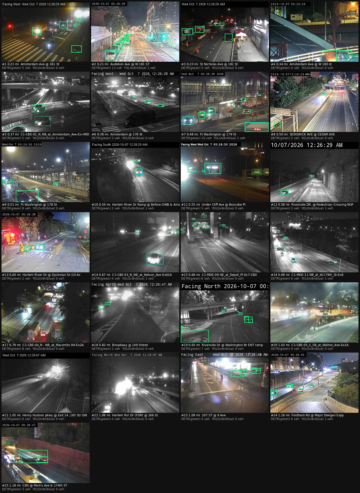
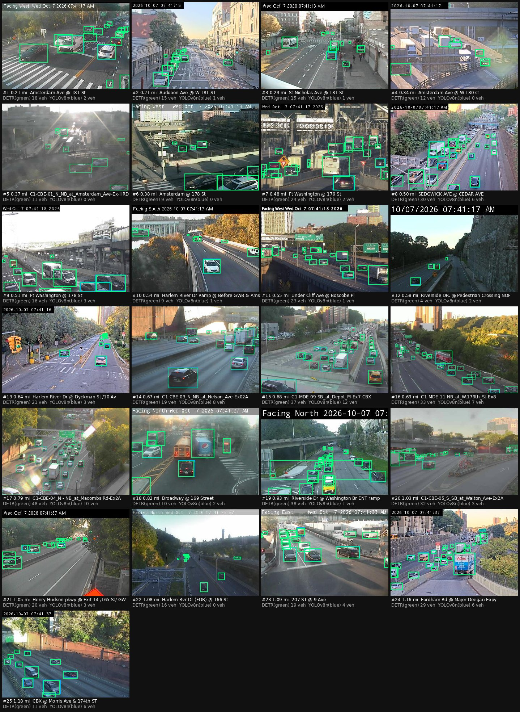

# Camera feasibility near 403 Audubon Ave

**Question:** can public NYC DOT/TMC cameras around 403 Audubon Ave tell me when to drive toward a particular block because parking looks open?

**Short answer, based on real frames (night and day):** technically yes, for one block face. Whether it helps in practice is still unproven.

- **The one usable view:** the camera labelled "Audobon Ave @ W 181 ST" looks **east along W 181st St toward Amsterdam Ave**. It shows the **north curb between Audubon and Amsterdam**, about 0.2 mi from 403 Audubon.
- **What it measures:** about 4 spaces reliably, plus ~4–6 more too small to measure.
- **The other cameras:** St Nicholas Ave @ 181 St shows a short curb row (2–3 spaces), a maybe. All other cameras within 0.75 mi point at highways, ramps, the Washington Bridge approach or intersections.
- **The detector works in both darkness and daylight.** The analysis reported the curb correctly as full in all 40 analyzed frames.
- **But no space opened** in the measurable stretch during a 15-minute morning window (7:41–7:57 AM). Whether openings occur often enough to be useful needs a longer observation.

## How this was measured

- **Where:** the dev container can't reach `webcams.nyctmc.org`, so discovery runs on GitHub's runners (`.github/workflows/parknearme-camera-discovery.yml`, script `scripts/discover-cameras.mjs`).
- **Runs:**
  - **Night:** 2026-10-07 04:26 UTC, **12:26 AM EDT**. Archived in `feasibility/night-2026-10-07/`.
  - **Day:** 11:41–11:57 UTC, **7:41–7:57 AM EDT**. Files are in `feasibility/`. Like the night run, it pulled 5 frames from every camera. It also recorded a **15-minute time series (30 more frames, 30 s apart)** for the three candidate cameras.
  - 403 Audubon Ave was geocoded by **NYC GeoSearch** to **40.851304, -73.930153** (BBL 1021560035). US Census and Nominatim agree within ~25 m.
  - Fetched the full TMC catalog: **976 cameras**.
  - Kept the **16 within 0.75 mi**, plus 9 more out to 1.25 mi for context.
  - Pulled **5 frames per camera, 4 s apart** (both runs).
- **Detectors:** `scripts/detect_vehicles.py` ran **facebook/detr-resnet-50** (the model behind `@cf/facebook/detr-resnet-50` on Workers AI) and YOLOv8n over every frame.
- **Outputs**, all in `feasibility/`:
  - `discovery.json`: raw catalog sample, headers, per-frame hashes and timings
  - `detections.json`
  - `contact-sheet.jpg` and `contact-sheet-annotated.jpg`
  - `annotated/<id>.jpg`
  - `frames/`: temporary development frames; delete any time
- **Pipeline check:** `npm run eval` runs the production curb-gap analysis on those recorded detections, using the lane drawn in `seed/calibrations.json`.

### Endpoint findings (verified)
- `GET https://webcams.nyctmc.org/api/cameras/` returns HTTP 200 with JSON array items `{id, name, latitude, longitude, area, isOnline, imageUrl}`. `isOnline` is a **string** (`"true"`/`"false"`). Headers: `cache-control: no-store`, no CORS header.
- `GET /api/cameras/{id}/image` returns `image/jpeg`, `no-store`, no CORS header.
  - Size: **352×240** for city cameras (13–24 KB), **720×480** for state highway cameras (17–38 KB).
  - **All 16 nearby cameras were online in both runs.** At night every camera returned 5 distinct frames in 5 pulls, so a new frame at least every 4 s. In the day run, 2 cameras repeated one frame (St Nicholas 34 of 35 distinct, Amsterdam @ 178 St 4 of 5).
  - Frames carry a burned-in clock, sometimes with a direction ("Facing West").
  - The Audubon camera's EXIF capture time was 1 s behind our fetch.
- **No CORS header**, so browser-side computer vision is impossible. The Worker proxies frames to the same origin.

## Every camera within 0.75 mi

*DETR vehicles = boxes with score ≥ 0.5 in frame 0 (night).*

| Camera | ID | Coordinates | From 403 Audubon | Status | Image fetched? | Useful for parking? | DETR vehicles | What's visible / notes |
|---|---|---|---|---|---|---|---|---|
| Amsterdam Ave @ 181 St | `4d39d6d1-a009-480f-9851-2571a5df1174` | 40.84833, -73.93087 | 0.21 mi | Online | Yes (5/5, 5 distinct, 352×240, ~16 KB) | No | 5 | Burned-in "Facing West". The W 181st St / Washington Bridge approach at Amsterdam: wide crosswalk, bridge railing, cars queueing at the light (confirmed in daylight). No curb parking lane. |
| Audobon Ave @ W 181 ST | `1ccb8d7c-43d4-450e-b40c-79527766db75` | 40.84874, -73.93235 | 0.21 mi | Online | Yes (5/5, 5 distinct, 352×240, ~23 KB) | **Yes** | 13 | Despite the name, it looks **east along W 181st St** (busway: BUS/TRUCK ONLY lanes) from Audubon toward Amsterdam. Direction was confirmed by the low morning sun ahead and the lit south-side facades. The left side of the view is the **north curb between Audubon and Amsterdam**: a row of ~8–10 parked cars, with the nearest ~4 spaces measurable (9 px/m) and the far end not (<1 px/m). A few cars are also parked on the far (south) curb. DETR found 11–20 vehicles per frame, day and night. |
| St Nicholas Ave @ 181 St | `3ad126cc-3f99-4626-a229-b9ba4d3f4b63` | 40.84931, -73.93374 | 0.23 mi | Online | Yes (5/5, 5 distinct, 352×240, ~16 KB) | Maybe | 5 | Looks along a wide avenue past a furniture store. The right curb holds a short row of 2–3 parked cars. The curb nearest the camera stayed empty for the whole 15 minutes, so it is most likely a bus stop or no-standing zone and would need a RESTRICTED mark. The left side has a construction zone (barrels, a parked box truck). Usable for ~2–3 spaces at most. |
| Amsterdam Ave @ W 180 st | `99bd1846-c0e4-4689-b077-63d2525bf1aa` | 40.84652, -73.93207 | 0.34 mi | Online | Yes (5/5, 5 distinct, 352×240, ~16 KB) | No | 4 | Points at a highway ramp/overpass structure (Trans-Manhattan Expwy / Cross Bronx). No street parking. |
| C1-CBE-01_N_NB_at_Amsterdam_Ave-Ex-HRD | `749f7d56-21e8-4716-8efc-624723f5b9a8` | 40.84593, -73.93109 | 0.37 mi | Online | Yes (5/5, 5 distinct, 720×480, ~37 KB) | No | 5 | Cross Bronx Expwy camera (720x480). Highway. |
| Amsterdam @ 178 St | `6728d273-d20b-44b7-868a-d54c00e50fab` | 40.84614, -73.93243 | 0.38 mi | Online | Yes (5/5, 5 distinct, 352×240, ~17 KB) | No | 3 | "Facing West" over the Trans-Manhattan Expwy trench; one car at an intersection in the foreground. No curb lane. |
| Ft Washington @ 179 St | `ad3df063-d5d6-458c-84e7-1242060649cf` | 40.84935, -73.93894 | 0.48 mi | Online | Yes (5/5, 5 distinct, 352×240, ~20 KB) | No | 10 | GWB approach / bus-terminal area with yield signs and trucks. Traffic lanes only. |
| SEDGWICK AVE @ CEDAR AVE | `d7d6c994-492d-4f3a-895e-745596825fb4` | 40.85210, -73.92070 | 0.50 mi | Online | Yes (5/5, 5 distinct, 352×240, ~24 KB) | No | 2 | Sedgwick Ave (Bronx) along a park; road only, across the Harlem River from home. |
| Ft Washington @ 178 St | `d8e022cc-c262-45ac-a939-8e86e20853fd` | 40.84866, -73.93921 | 0.51 mi | Online | Yes (5/5, 5 distinct, 352×240, ~20 KB) | No | 8 | Trans-Manhattan Expwy / GWB approach. Highway. |
| Harlem River Dr Ramp @ Before GWB & Amst_179St Exit | `936d479d-402f-468a-b1c6-b2c2a68a0b4c` | 40.84359, -73.93150 | 0.54 mi | Online | Yes (5/5, 5 distinct, 352×240, ~13 KB) | No | 2 | Harlem River Dr ramp. Highway. |
| Under Cliff Ave @ Boscobe Pl | `9f118098-cee3-4964-8630-b932c94f70a3` | 40.84440, -73.92501 | 0.55 mi | Online | Yes (5/5, 5 distinct, 352×240, ~14 KB) | No | 5 | "Facing West" highway ramp near Undercliff Ave (Bronx). |
| Riverside DR. @ Pedestrian Crossing NOF 181 St | `db028e65-b4b4-4f83-a427-6be6cb3f2ace` | 40.85238, -73.94109 | 0.58 mi | Online | Yes (5/5, 5 distinct, 352×240, ~13 KB) | No | 2 | Riverside Dr / Henry Hudson Pkwy at a pedestrian crossing. Parkway, no parking. |
| Harlem River Dr @ Dyckman St /10 Av | `e610bc71-9bfb-4a92-928d-ad33cd1b9afd` | 40.85889, -73.92304 | 0.64 mi | Online | Yes (5/5, 5 distinct, 352×240, ~22 KB) | No | 2 | Harlem River Dr @ Dyckman St / 10 Av intersection. No curb parking in view. |
| C1-CBE-03_N_NB_at_Nelson_Ave-Ex02A | `4302c1d7-48aa-45a8-a9cc-93e3132c1530` | 40.84478, -73.92057 | 0.67 mi | Online | Yes (5/5, 5 distinct, 720×480, ~17 KB) | No | 4 | Cross Bronx Expwy (720x480). Highway. |
| C1-MDE-09-SB_at_Depot_Pl-Ex7-CBX | `c8b15922-4262-459a-85d5-17442ec9c54f` | 40.84154, -73.92861 | 0.68 mi | Online | Yes (5/5, 5 distinct, 720×480, ~28 KB) | No | 6 | Major Deegan Expwy (720x480). Highway. |
| C1-MDE-11-NB_at_W.179th_St-Ex8 | `b9ba6a87-0e0b-4c5a-ad6a-7ead399e0864` | 40.85513, -73.91801 | 0.69 mi | Online | Yes (5/5, 5 distinct, 720×480, ~30 KB) | No | 6 | Major Deegan Expwy (720x480). Highway. |

Context ring (0.75–1.25 mi): Cross Bronx and Major Deegan expressways, Broadway @ 169 St, Riverside Dr @ Washington Bridge ramp, Henry Hudson Pkwy, Harlem River Dr @ 166 St, 207 St @ 9 Ave, Fordham Rd @ Major Deegan, CBX @ Morris Ave. None were assessed as parking views for this address.

## What the detector and analysis actually saw

- **DETR at native 352×240 works, even at night.** It found 11–17 vehicles per frame on the 181st St camera, including cars only ~9 px long. **YOLOv8n found almost nothing** on the same frames: 0–1 vehicles on most cameras, 67 boxes in total vs DETR's 600. A COCO DETR is a reasonable starting detector; a nano YOLO is not.
- **DETR quirks:**
  - It returns duplicate boxes (car 0.96 and truck 0.86 on the same pixels) and part-boxes, which the Worker removes with class-agnostic NMS plus part-box suppression.
  - It also produces stray labels (umbrella, bench, train), which are ignored.
- **Curb-gap analysis on the 181st St night frames** (5 frames; the 35 daytime frames are covered under *Daylight check*): 7–10 parked cars counted along the calibrated lane, **no openings**, status *none* at 84–88% confidence across all 5 frames. That fits a full residential curb at 12:30 AM. The car driving in the travel lane was correctly classified as traffic.
- **Geometry limit:** along this lane the image gives **9.3 px per metre at the near end and 0.7 px/m at the far end**.
  - The analysis only reports gaps where there are at least 1.3 px/m, so effectively the nearest **~4 spaces (~25 m)** of curb are trustworthy.
  - The calibration error is 0.9 m per pixel of corner error (good).

## Answer: is this useful?

**Partly. It's useful for one block, and only as a "glance before you drive" hint. The first 15-minute sample saw no openings at all.**

- **What works:** live frames every few seconds, reliable fetches, a detector that sees parked cars at night, and a measurement model that refuses to report openings it can't see.
- **What limits it:**
  1. **Coverage.** One usable camera, plus a "maybe" on St Nicholas Ave, out of 16. Most DOT cameras here watch highways and bridge approaches.
  2. **The useful camera shows the north curb of W 181st St between Audubon and Amsterdam, not 403 Audubon's own block** (403 is about 3½ blocks north, near W 184th–185th). It answers "is there anything on 181st between Audubon and Amsterdam right now?"
  3. **Only ~4 spaces are measurable;** the far end of the block is too small in the image.
  4. **Turnover is unknown.** All 40 analyzed frames (12:26 AM and 7:41–7:57 AM) showed a full curb.
  5. **Legality isn't visible.** The 181st St busway has bus/truck-only lanes and likely loading or time rules on the curb, and hydrants or driveways must be hand-marked RESTRICTED in `/calibrate`.
- **Expected value:** on a packed block, an open spot near the camera usually lasts minutes. The app checks on open and on refresh, and every 2 minutes when alerts are on. That's fast enough to catch some openings, but you'll still be driving 2–3 minutes to get there.

## Daylight check (7:41–7:57 AM EDT)

- **Camera directions confirmed.** Audubon @ 181 looks east along W 181st St. Amsterdam @ 181 looks west at the bridge approach. St Nicholas @ 181 looks along St Nicholas Ave.
- **The seed calibration still fits.** The lane drawn on the 12:26 AM frame lines up with the parked row in daylight, so the camera was not re-aimed overnight.
- **Detection works in daylight.** DETR found 13–20 vehicles per frame on the 181st St camera, including the parked row, a double-parked SUV, buses, a school bus and a box truck. YOLOv8n again found almost nothing (0–3 per frame).
- **Time series:** the near part of the north curb was **full in all 35 frames** over 15 minutes (checked by eye on a crop of every frame). Cars stopped beside the row and buses passed, but no space opened.
- **Analysis over the same 35 frames:** `npm run eval` gave status *none* every time, at 77–91% confidence. There were no false openings, including when a bus or the double-parked SUV hid part of the row, and no missed ones.
- **Implications:**
  - The sensor and analysis behave correctly.
  - Usefulness now depends only on turnover. On this block at 7:45 AM on a weekday there was none.
  - Expect most checks to say "full". The app is worth something only if openings show up at the times you're driving home.

## Recommended next experiment

1. **Validate on real Workers AI:** deploy and confirm which detector actually answers (DETR, or the Moondream fallback). Then press **Analyze** on the 181st St camera at 8 AM, 1 PM, 6 PM and 11 PM, and compare against the frame by eye.
2. **Collect ground truth for one week:**
   - Set background checks to *Always* for the 181st St camera only (~720 analyses/day, still within the free AI tier with DETR).
   - Use `/cameras/:id` history to count how often an opening appears near the camera and how long it lasts.
   - Label 50–100 frames by hand (open / full) to fit the detector recall curve and the confidence threshold. Both are currently physics-based guesses.
3. **Mark the curb rules** for that block as RESTRICTED zones (hydrant within 15 ft, crosswalk, any loading zone). Read the 181st St busway signs once in person.
4. **Re-run discovery quarterly.** Cameras get re-aimed, and new ones get added.
